<!-- _class: lead
-->

# Ускоряем __Allure__.__TestOps__

## Смирнов Вячеслав

### _17 октября 2024_

<!--
_footer: `Image by Vlad Gerasimov on https://vlad.studio/`
 -->
---


<!-- _class: title -->

# Ускоряю  Miro
## Пишу в  qa_load
### Любуюсь горами


---

<!-- _class: main  -->

# Тысячи тестов автоматизированы,  ___Allure__.__TestOps__ не тормозит_

---

<!-- _class: main  -->

# _Тысячи тестов автоматизированы,_  __Allure__.__TestOps__ не тормозит


---

# 🟢 Allure TestOps _: Как устроена система?_

# 🟡 Масштабирование _сервисов и баз данных_

# 🟠 Оптимизации _настроек и SQL-запросов_

# 🔴 Радикальные оптимизации _: кеширование и удаление_

# 🟣 Рекомендации и скрипты _: Как автоматизировать?_ 
---

# _🟢 Allure TestOps : Как устроена система?_

# 🟡 Масштабирование _сервисов и баз данных_

# 🟠 Оптимизации _настроек и SQL-запросов_

# 🔴 Радикальные оптимизации _: кеширование и удаление_

# _🟣 Рекомендации и скрипты : Как автоматизировать?_ 

---

# _🟢 Allure TestOps : Как устроена сиыстема?_

# _🟡 Масштабирование сервисов и баз данных_

# 🟠 __Оптимизации__ настроек и SQL-запросов

# _🔴 Радикальные оптимизации : кеширование и удаление_

# _🟣 Рекомендации и скрипты : Как автоматизировать?_ 

---

# _🟢 Allure TestOps : Как устроена система?_

# _🟡 Масштабирование сервисов и баз данных_

# _🟠 __Оптимизации__ настроек и SQL-запросов_

# _🔴 Радикальные оптимизации : кеширование и удаление_

# _🟣 Рекомендации и скрипты : Как автоматизировать?_ 

# ☕️ Оптимизация вашей __Allure TestOps__
---

<!-- _class: main -->

# ☕️ Оптимизация вашей __Allure TestOps__

---

<!-- _class: main problem -->

## 🟢 __Allure__ __TestOps__

# Как устроена система?

---

<!-- _class: main -->

# Allure Report

---

<!-- _class: main -->

# Allure TestOps 


---

<!-- _class: main -->

# Профили

---

<!-- _class: main -->

# Сервисы

---

<!-- _class: main -->

# Потоки приложений

---


<!-- _class: main -->

# Потоки подключения к базам данных


---

<!-- _class: main problem -->

## 🟡 __Масштабирование__

# cервисов и баз данных

---

<!-- _class: main problem -->

## 🟡 __Масштабирование__

# Как масштабировать сервисы?

---


<!-- _class: main -->

# Сервис __report__ наиболее нагруженный

---

<!-- _class: main problem -->

## 🟡 __Масштабирование__

# Как масштабировать базу данных?


---


<!-- _class: main -->

# База данных __report__ наиболее нагруженная


---

<!-- _class: main problem -->


## 🟠 __Оптимизации__ 

# настроек и SQL-запросов

---

<!-- _class: main problem -->


## 🟠 __Оптимизации__ 

# Какие настройки поправить?


---

<!-- _class: main solution -->

# Мы масштабировали __report__ сервис.

---

<!-- _class: main  -->

# _Мы масштабировали __report__ сервис,_ потоков стало __кратно__ больше.

---

<!-- _class: main error -->

# _Мы масштабировали __report__ сервис, потоков стало __кратно__ больше,_ некоторых потоков __слишком__ много

---

<!-- _class: main error -->

# _Мы масштабировали __report__ сервис, потоков стало __кратно__ больше,_ некоторых потоков __слишком__ много, некоторых же __недостаточно__ много

---

<!-- _class: main  -->

# Мы масштабировали __report__ сервис, _потоков стало __кратно__ больше, некоторых потоков __слишком__ много, некоторых же __недостаточно__ много_


---

<!-- _class: main  -->

# Мы масштабировали __report__ сервис, _потоков стало __кратно__ больше,_ <s> некоторых потоков __слишком__ много, некоторых же __недостаточно__ много </s>

---

<!-- _class: main solution -->

# Мы масштабировали __report__ сервис, _потоков стало __кратно__ больше,_ количество __RabbitMQ__-потоков снизили, а __HicaryCP__ увеличили

---

<!-- _class: main solution -->

# Мы масштабировали __report__ сервис.

---

<!-- _class: main -->

# _Мы масштабировали __report__ сервис,_ активность работы с базами данных __PostgreSQL__ выросла.

---

<!-- _class: main error -->

# _Мы масштабировали __report__ сервис, активность работы с базами данных __PostgreSQL__ выросла,_ производительность __PostgreSQL__ конечна

---

<!-- _class: main  -->

# Добавим ресурсов для __PostgreSQL__

---

<!-- _class: main  -->

# Оптимизируем SQL-запросы к __PostgreSQL__


---

<!-- _class: main  -->

# _Оптимизируем SQL-запросы к __PostgreSQL__,_ возможности поменять текст запросов __Allure.TestOps__ нет

---

<!-- _class: main  -->

# _Оптимизируем SQL-запросы к __PostgreSQL__, возможности поменять текст запросов __Allure.TestOps__ нет,_ создадим индексы

---

<!-- _class: main solution -->

# Cоздадим индексы в __PostgreSQL__


---

<!-- _class: main problem -->

# А надо ли создавать индексы?

---

<!-- _class: main  -->

# В __Allure__.__TestOps__ уже есть индексы на все поля

---

# Индекс

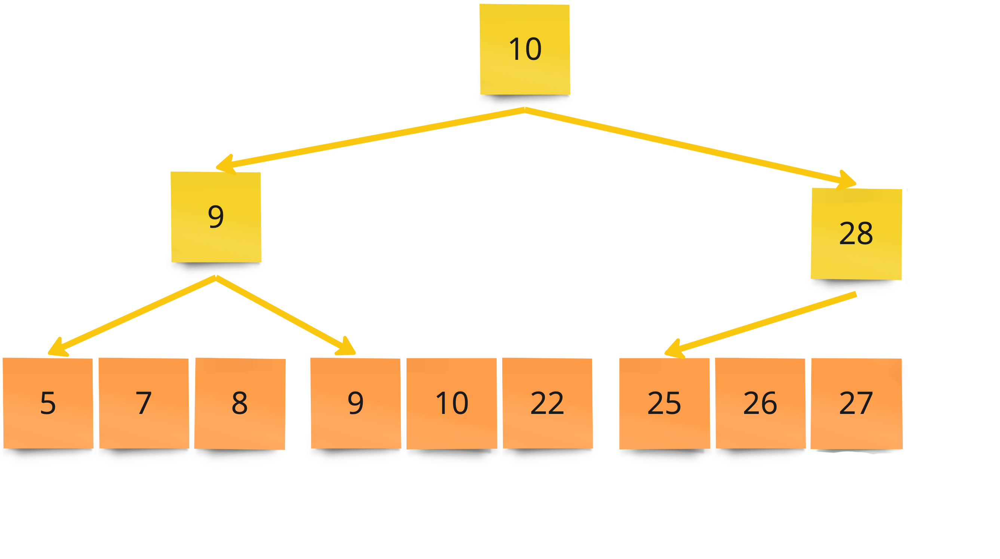

---

<!-- _class: main  -->

# Но некоторых индексов не хватает


---

# Несколько полей

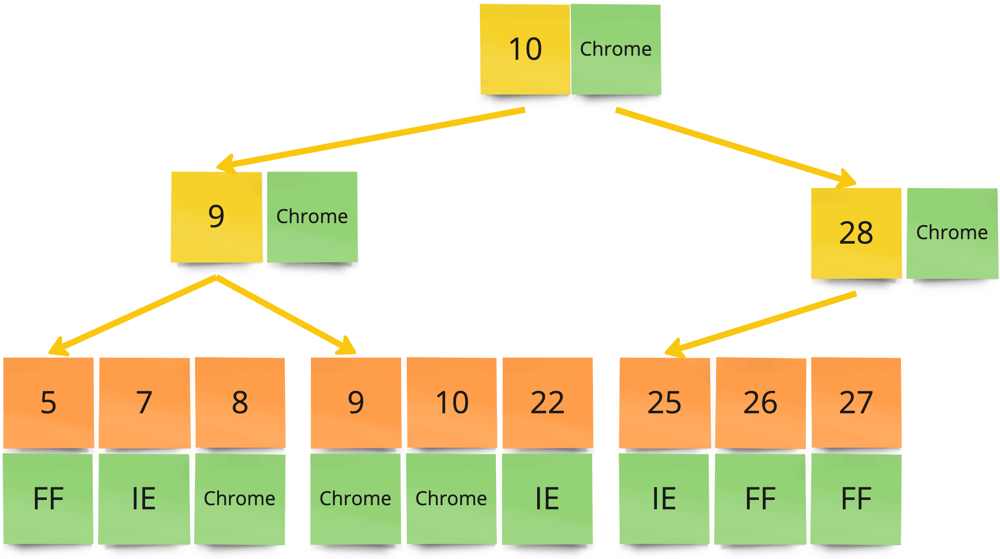

---

# В другом порядке

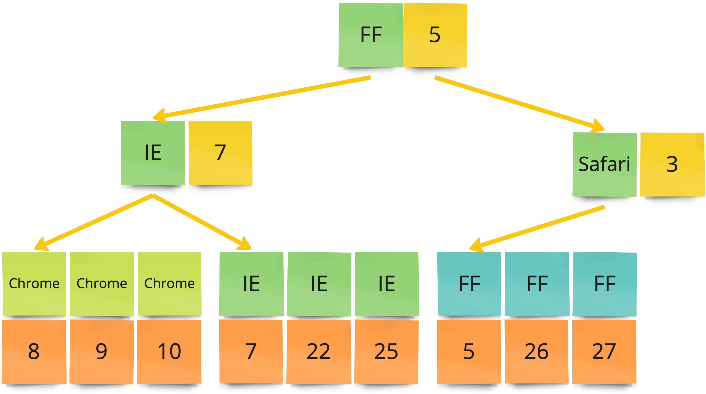


---

# __С фильтрацией__ по значению
# browser == 'Chrome'

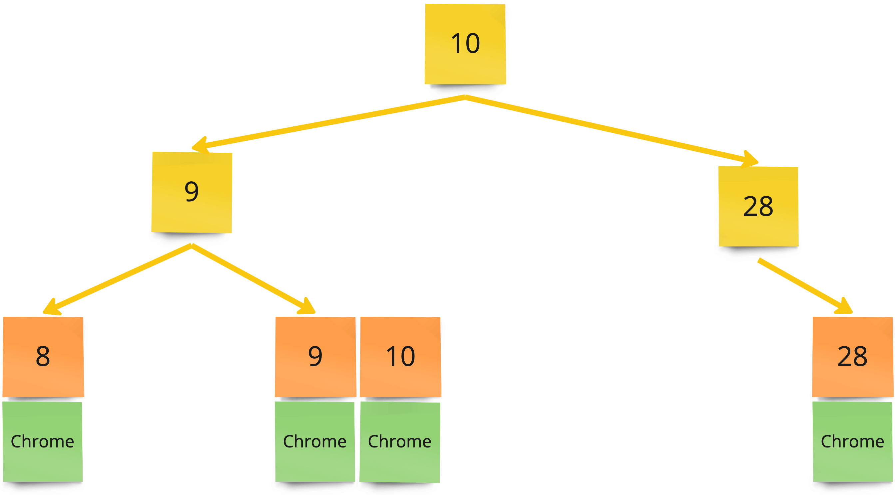

---

# __С фильтрацией__ по новым данным
# id >= 9995

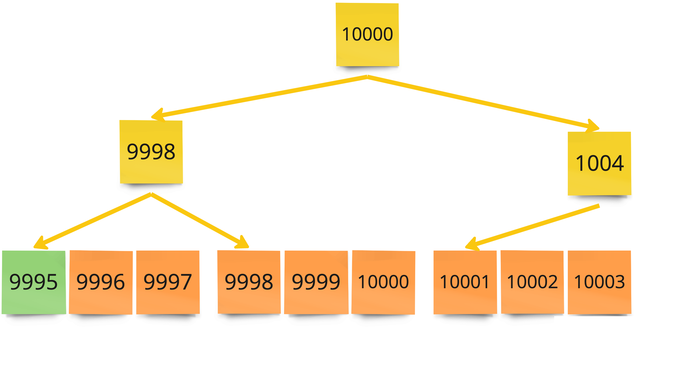

---

<!-- _class: main -->

# 10 _х 10 х 10_


---

<!-- _class: main -->

# 10 х 10 _х 10_

---

<!-- _class: main -->

# 10 х 10 х 10

---

<!-- _class: main problem -->

# На какие запросы создавать индексы?

---

<!-- _class: main2 -->

# ⚡️ Мгновенная cтатистика по __PostgreSQL__

## доступная сразу на текущий момент времени или за всю историю 

---


<!-- _class: main2 -->

# __pg_stat_activity__

## текущие активные запросы

---

<!-- _class: main2 -->

# __pg_stat_statement__

## успешно выполненные запросы

---

<!-- _class: main2 -->

# __Логи__

## тексты запросов со всеми параметрами

---

<!-- _class: main2 -->

# 🌟 Интервальная cтатистика по __PostgreSQL__

## за выбранный период, ее надо накопить


---

# __pg_stat_activity__ 
## ⚡️ данные за текущий момент
## 🌟 суммарные данные

# __pg_stat_statement__ 
## ⚡️ суммарные данные за долгое время
## 🌟 дельта данных

# __логи__ PostgreSQL 
## ⚡️ отсортированные по длительности
## 🌟 суммарные данные в отчете


---

# ___pg_stat_activity___ 
## _⚡️ данные за текущий момент_
## _🌟 суммарные данные_

# __pg_stat_statement__ 
## ⚡️ суммарные данные за долгое время
## _🌟 дельта данных_

# ___логи__ PostgreSQL_ 
## _⚡️ отсортированные по длительности_
## _🌟 суммарные данные в отчете_

---

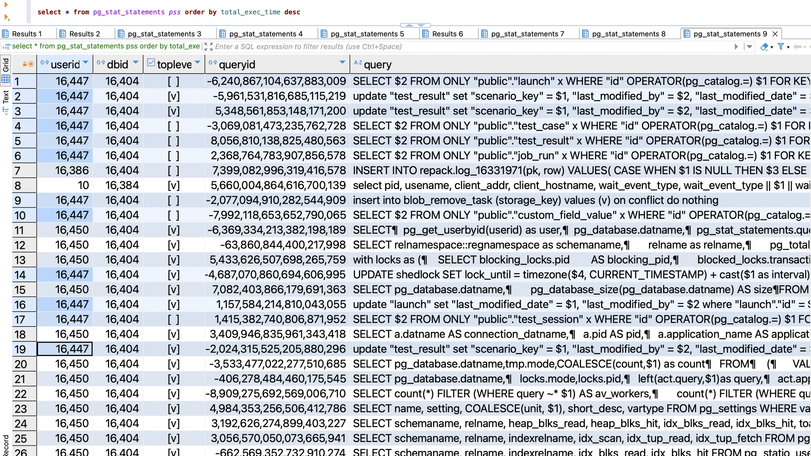

---

# __Ложный__ TOP-1 запрос

```sql
SELECT $2 
FROM ONLY "public"."launch" x 
WHERE "id" OPERATOR(pg_catalog.=) $1 
FOR KEY SHARE OF x
update "test_result" 
set 
    "scenario_key" = $1, 
    "last_modified_by" = $2, 
    "last_modified_date" = $3 
where "test_result"."id" in ($4)
update "test_result" 
set 
    "scenario_key" = $1, 
    "last_modified_by" = $2, 
    "last_modified_date" = $3 
where "test_result"."id" in ($4, $5)
```

---

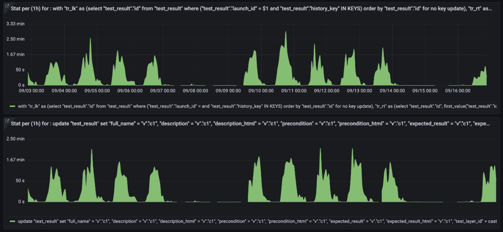

---

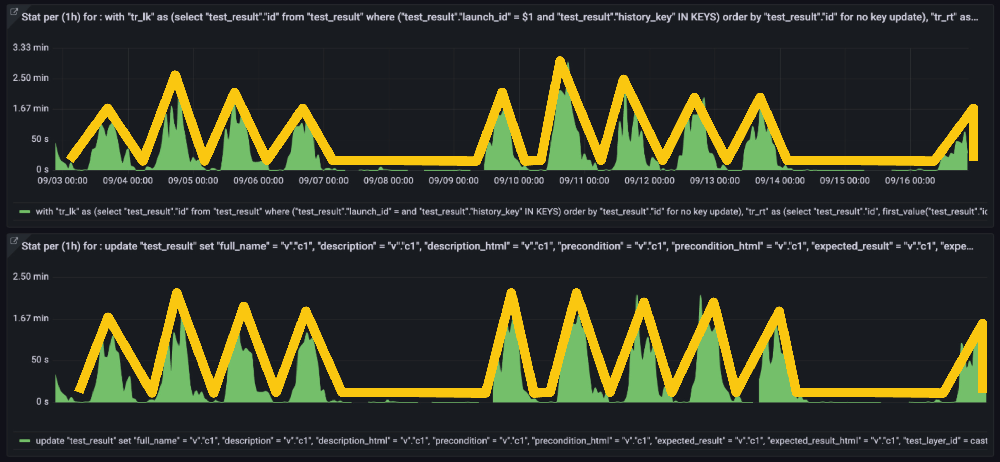


---


---


---


---

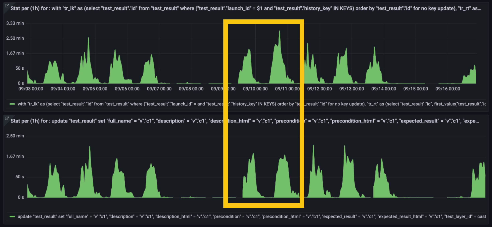

---

# Очень много __запросов-дубликатов__

```sql
select ... from test_result where id in ($1)

select ... from test_result where id in ($1, $2)

select ... from test_result where id in ($1, $2, 3)

select ... from test_result where id in ($1, $2, $3, $4)

select ... from test_result where id in ($1, $2, $3, $4, $5)

select ... from test_result where id in ($1, $2, $3, $4, $5, $6)

...

```

---

# Можно __схлопнуть__ дубликаты за счет регулярных выр

```sql
select query_key, query, queryid, 
    sum(total_exec_time) as time_sum
from (select
  regexp_replace(regexp_replace(regexp_replace(regexp_replace(
	regexp_replace(query, 
	' in [(][^)]+[)]', ' IN KEYS', 'g'),
	'[(]values [(].+[))]', '(VALUES (VAL))', 'g'),
	' values [(].+[)]', ' VALUES (VAL)', 'g'),
	'([0-9]+)', '1', 'g'),
	'(\n|\t|\s|\r|\v|\a|\b| )+', ' ', 'g')
	as "query_key", -- Template
	total_exec_time, query, queryid
  from pg_stat_statements
) foo
group by query_key, query, queryid
order by total_exec_time_sum desc, query_key, query
```

---

# Можно __схлопнуть__ дубликаты за счет регулярных выражений

```pl
select query_key, query, queryid, 
    sum(total_exec_time) as time_sum
from (select
  regexp_replace(regexp_replace(regexp_replace(regexp_replace(
	regexp_replace(query, 
```
```sql
	' in [(][^)]+[)]', ' IN KEYS', 'g'),
	'[(]values [(].+[))]', '(VALUES (VAL))', 'g'),
	' values [(].+[)]', ' VALUES (VAL)', 'g'),
	'([0-9]+)', '1', 'g'),
	'(\n|\t|\s|\r|\v|\a|\b| )+', ' ', 'g')
```
```pl
	as "query_key", -- Template
	total_exec_time, query, queryid
  from pg_stat_statements
) foo
group by query_key, query, queryid
order by total_exec_time_sum desc, query_key, query
```

---

# Можно посчитать изменение метрики

Создать слепок:
```sql
	select * 
	into pg_stat_statements_2024_10_10
	from pg_stat_statements
```

---

# Подождать и получить разницу


```sql
select "query_key", count(queryid) as "count", max(query) as "query",
	round(sum(total_exec_time)) as total_exec_time, sum(calls) as calls, 
	sum(total_exec_time)/sum(calls) as "mean",
	round(sum(shared_blks_hit)/sum(calls)) as "shared_blks_hit"
from ( select 
		regexp_replace(regexp_replace(regexp_replace(regexp_replace(regexp_replace(p.query,       
		' in [(][^)]+?[)]', ' IN KEYS', 'g'),
		'\(values \(.+?\)\)', '(VALUES (VAL))', 'g'),
		' values \(.+?\)', ' VALUES (VAL)', 'g'),
		'([0-9]+)', '1', 'g'),
		'(\n|\t|\s|\r|\v|\a|\b| )+', ' ', 'g') as "query_key",
		p.queryid, p.query,
		p.total_exec_time - prev.total_exec_time as total_exec_time,
		p.shared_blks_hit - prev.shared_blks_hit as shared_blks_hit,
		p.calls - prev.calls as calls,
		(p.total_exec_time - prev.total_exec_time) / (p.calls - prev.calls) as mean
	from  pg_stat_statements p join pg_stat_statements_2024_10_10 prev
		on (p.queryid = prev.queryid)
	where p.calls > prev.calls
) as stat
group by "query_key" order by total_exec_time desc
```

---

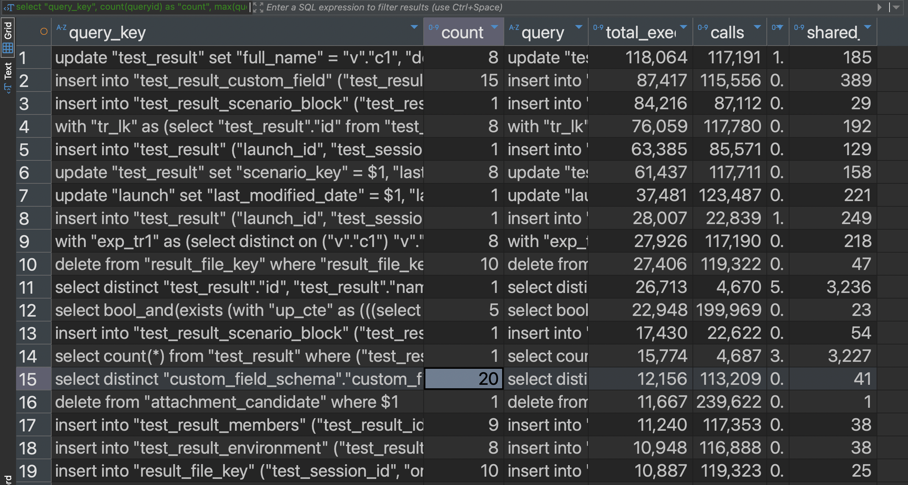

---

<!-- _class: main -->

# shared_blk_hit

---

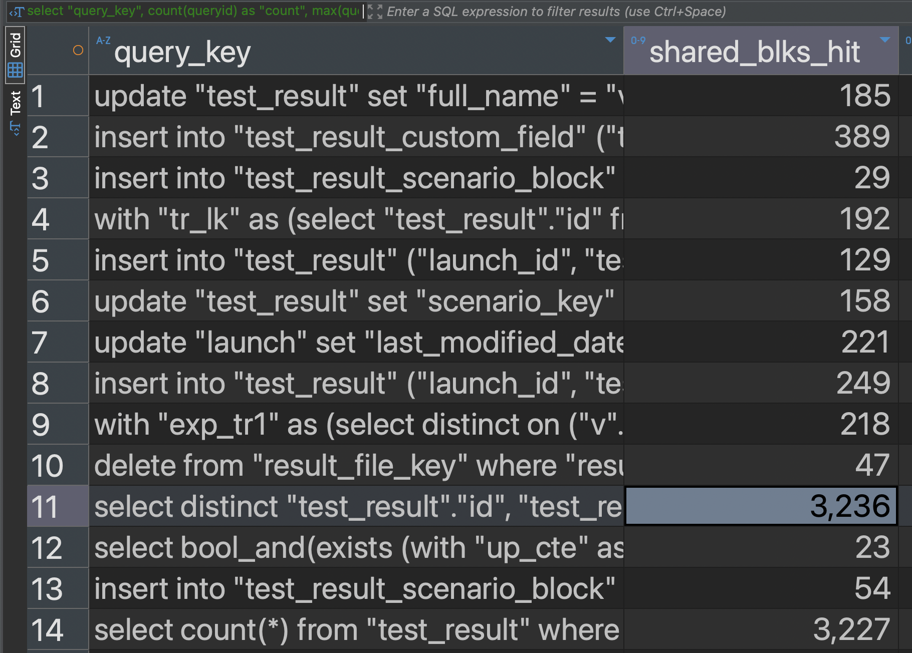

---

# ___pg_stat_activity___ 
## _⚡️ данные за текущий момент_
## _🌟 суммарные данные в VictoriaMetrics_

# __pg_stat_statement__ 
## _⚡️ суммарные данные за долгое время_
## 🌟 дельта данных

# ___логи__ PostgreSQL_ 
## _⚡️ отсортированные по длительности_
## _🌟 суммарные данные в отчете_


---

<!-- _class: main problem -->

## 🔴 __Радикальные оптимизации__

# кеширование и удаление

---

<!-- _class: main problem -->

# Есть очень медленные HTTP запросы на странице проекта /project/{ID}__/dashboards__

---

<!-- _class: main problem -->

# /api/rs/analytic/{ID}__/statistic_trend__  /api/rs/analytic/{ID}__/automation_chart__

---

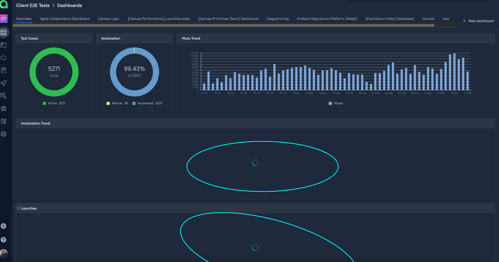

---

<!-- _class: main error -->

# 180 секунд на GET-запрос

---

<!-- _class: main -->

# __180__ секунд будут заняты __2__ JDBC-подключения к __реплике__ базы данных, на каждого пользователя, открывшего проект

---

<!-- _class: main -->

# Индексами проблему не решить _(пробовал)_

---

<!-- _class: main solution -->

# Можно __отключить__ GET-запросы вообще

---

<!-- _class: main solution -->

# Можно __отключить__ GET-запросы вообще: /api/rs/analytic/__3__/statistic_trend и /api/rs/analytic/__3__/automation_chart

---

<!-- _class: main -->

# Используя __NGinx__ мы __отключим__ или __закешируем__ два аналитических GET-запроса для самого большого проекта __(№ 3)__

---

# Закешируем

```nginx
http {
    proxy_cache_path /data/nginx/cache keys_zone=mycache:60m max_size=1g inactive=120m;
    limit_conn_zone $server_name zone=perserver:10m;
    upstream backend {server allure:443}
    server {
        listen 80;

        location /api/rs/analytic/3/statistic_trend {
            include shared.cache.conf;
        }
        location /api/rs/analytic/3/automation_chart {
            include shared.cache.conf;
        }
        location / {
            proxy_pass https://backend;
        }
    }
}
```

---
# Закешируем

```pl
http {
    proxy_cache_path /data/nginx/cache keys_zone=mycache:60m max_size=1g inactive=120m;
    limit_conn_zone $server_name zone=perserver:10m;
    upstream backend {server allure:443}
    server {
        listen 80;
```
```nginx
        location /api/rs/analytic/3/statistic_trend {
            include shared.cache.conf;
        }
        location /api/rs/analytic/3/automation_chart {
            include shared.cache.conf;
        }
```
```pl
        location / {
            proxy_pass https://backend;
        }
    }
}
```

---

# Содержимое файле __shared.cache.conf__
```nginx
# кешировать по URL-запроса
proxy_cache_key "$host$request_uri";

# на 60 минут для успешных ответов
proxy_cache_valid 200 302 60m;

proxy_cache_valid 404      1m;
proxy_cache_min_uses 1;
proxy_cache_methods GET;
proxy_cache_background_update on;
proxy_cache_revalidate on;
proxy_cache_lock on;
add_header X-Cache-Status $upstream_cache_status;
proxy_ignore_headers Cache-Control;
proxy_pass https://backend;
```

---

# Кешировать по URL-запроса
```pl
# кешировать по URL-запроса
```
```nginx
proxy_cache_key "$host$request_uri";
```
```pl
# на 60 минут для успешных ответов
proxy_cache_valid 200 302 60m;

proxy_cache_valid 404      1m;
proxy_cache_methods GET;
proxy_cache_background_update on;
proxy_cache_revalidate on;
proxy_cache_lock on;
add_header X-Cache-Status $upstream_cache_status;
proxy_ignore_headers Cache-Control;
proxy_pass https://backend;
```

---


# Кешировать на __60__ минут для успешных ответов с кодами __200__ или __302__
```pl
# кешировать по URL-запроса
proxy_cache_key "$host$request_uri";

# на 60 минут для успешных ответов
```
```nginx
proxy_cache_valid 200 302 60m;

```
```pl
proxy_cache_valid 404      1m;
proxy_cache_min_uses 1;
proxy_cache_methods GET;
proxy_cache_background_update on;
proxy_cache_revalidate on;
proxy_cache_lock on;
add_header X-Cache-Status $upstream_cache_status;
proxy_ignore_headers Cache-Control;
proxy_pass https://backend;
```

---

<!-- _class: main problem -->

# Как удалить __старые__ данные?

---

<!-- _class: main -->

# https://help.qameta.io/ > Knowledge base > General > Maintenance > __Storage and database cleanup__ 

---

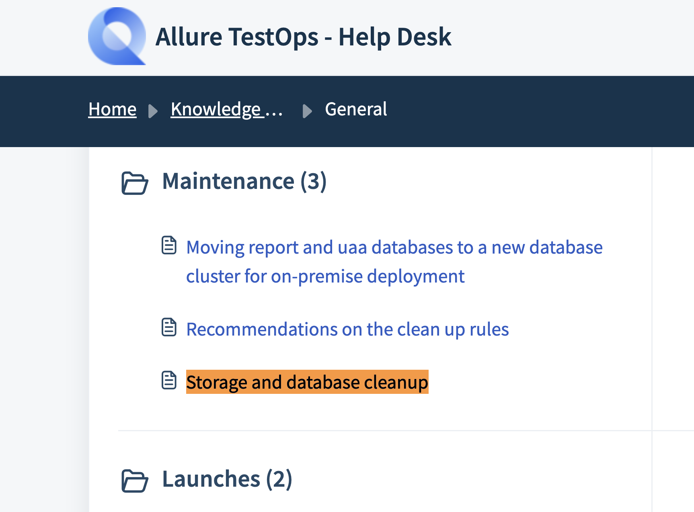

---

# Храним __2__ недели данные для тестов со статусом __Broken__ и __Failed__
# Храним __1__ неделю данные для тестов со статусом __Passed__ и __Skipped__

# Данные это
- scenario

	- результаты выполнения шагов
- fixture
	- вложения, картинки в блоки в общие шаги @SetUp, @Teardown
- attachment
	- вложения, картинки в блоки @Test

---

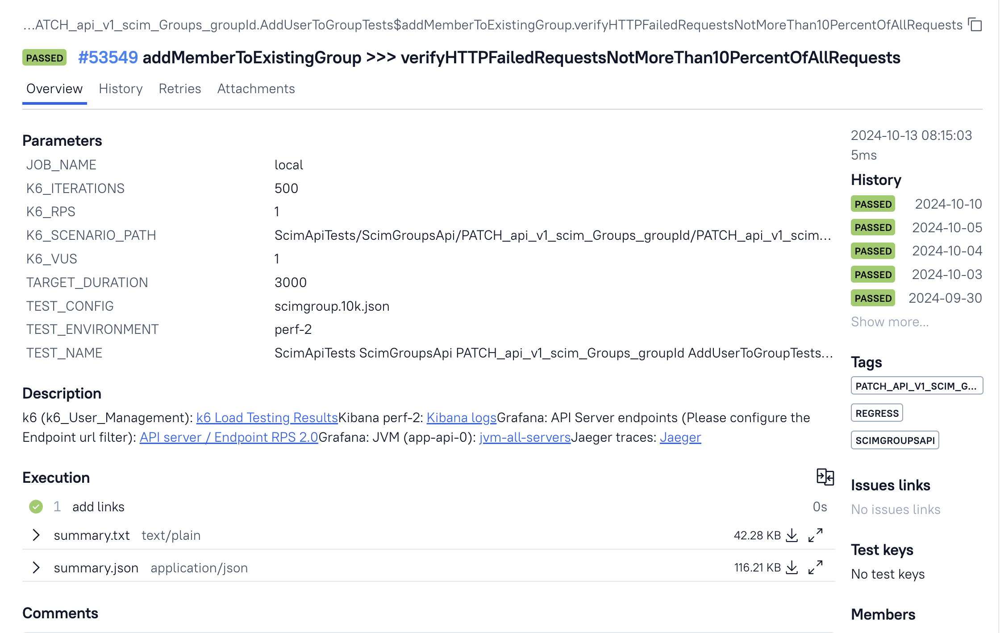

---

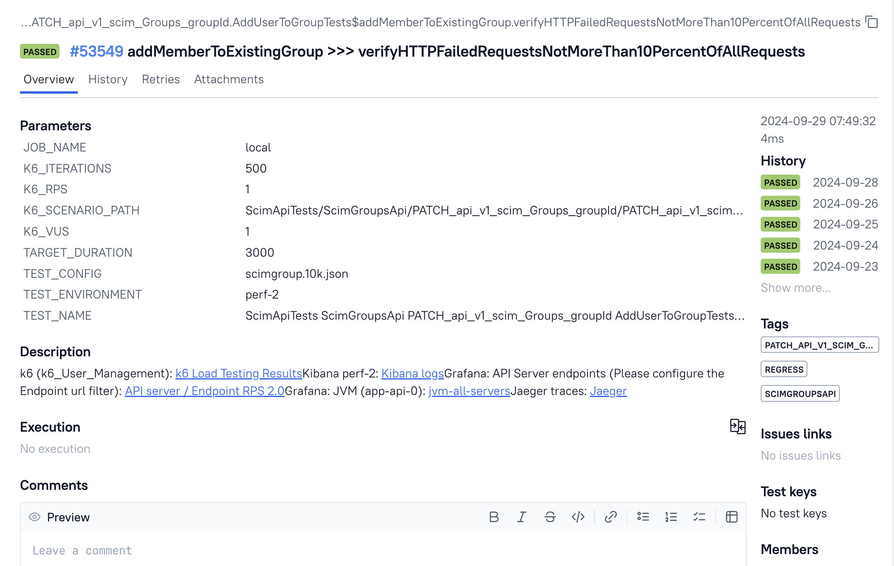

---

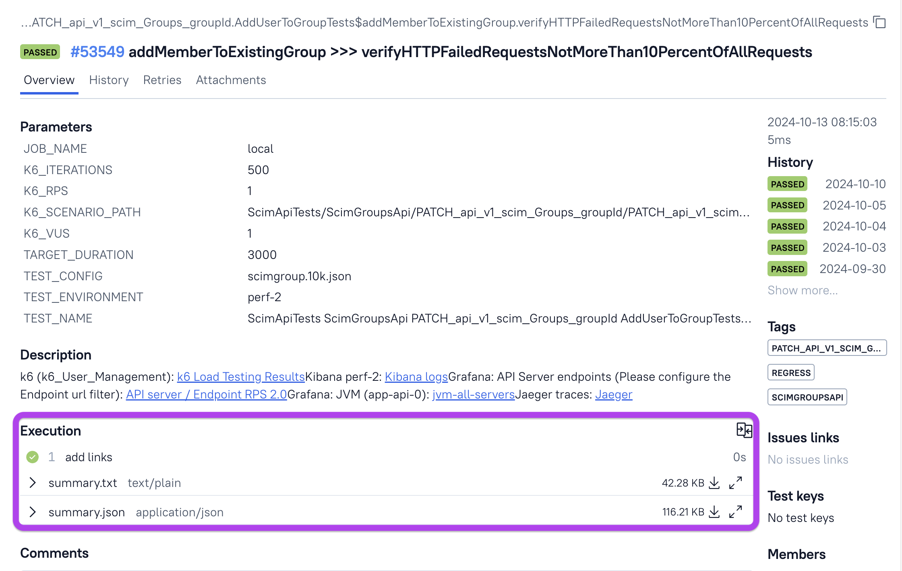

---

## scenario (шаги теста и их статусы)
- Remove __scenario__ on __Broken__ test results after __336__ hours
- Remove __scenario__ on __Failed__ test results after __336__ hours
- Remove __scenario__ on __Passed__ test results after __168__ hours
- Remove __scenario__ on __Skipped__ test results after __168__ hours

## fixture (вложения в общие шаги теста)
- Remove __fixture__ on __Broken__ test results after __336__ hours
- Remove __fixture__ on __Failed__ test results after __336__ hours
- Remove __fixture__ on __Passed__ test results after __168__ hours
- Remove __fixture__ on __Skipped__ test results after __168__ hours

## attachment (вложения в шаги теста)
- Remove __attachment__ on __Broken__ test results after __336__ hours
- Remove __attachment__ on __Failed__ test results after __336__ hours
- Remove __attachment__ on __Passed__ test results after __168__ hours
- Remove __attachment__ on __Skipped__ test results after __168__ hours

---

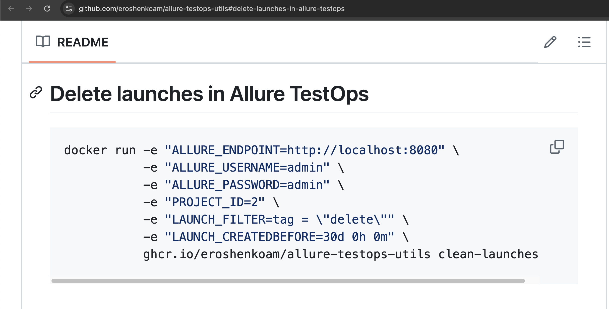

---

<!-- _class: main -->

# Delete (tool) > Vacuum

---

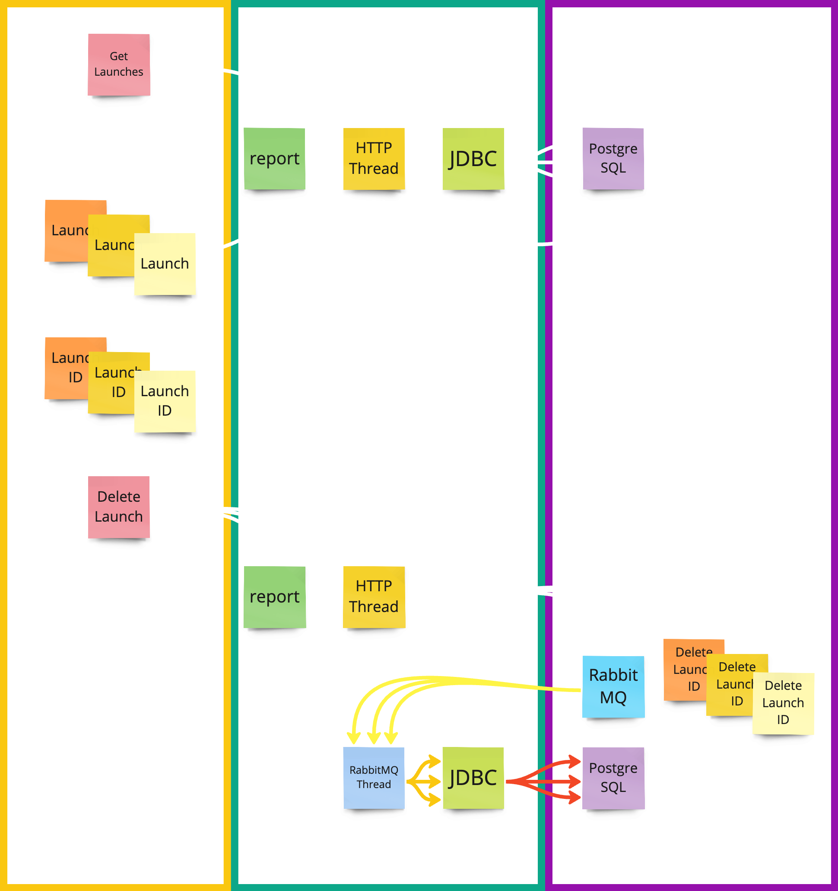

---

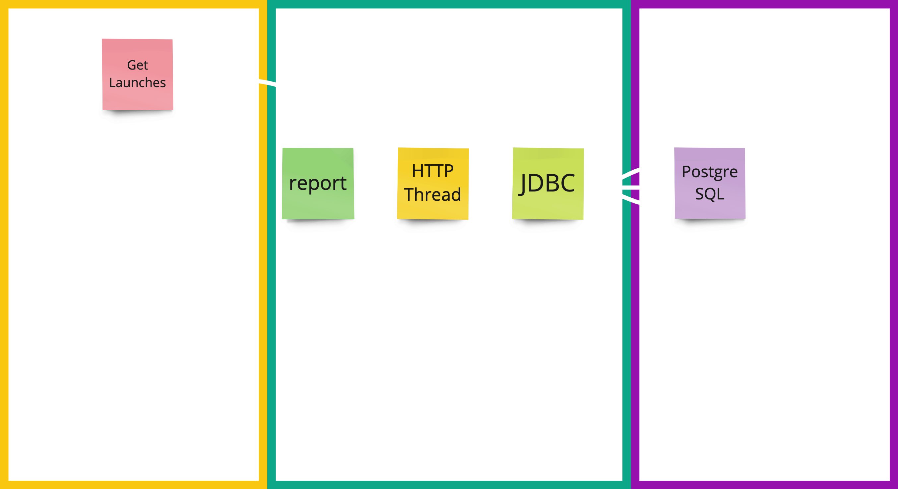

---

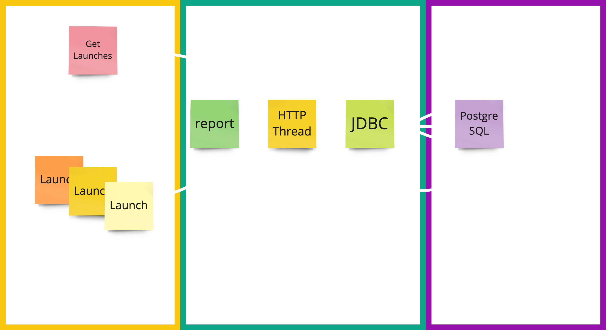

---

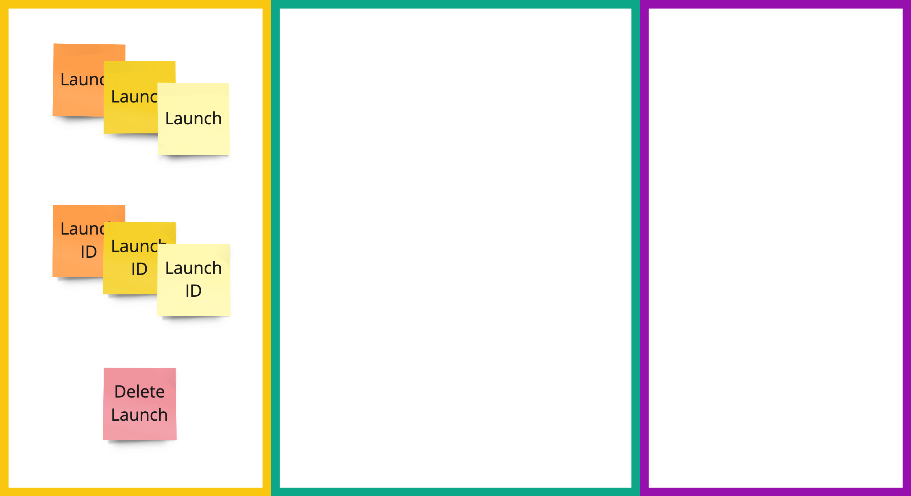

---

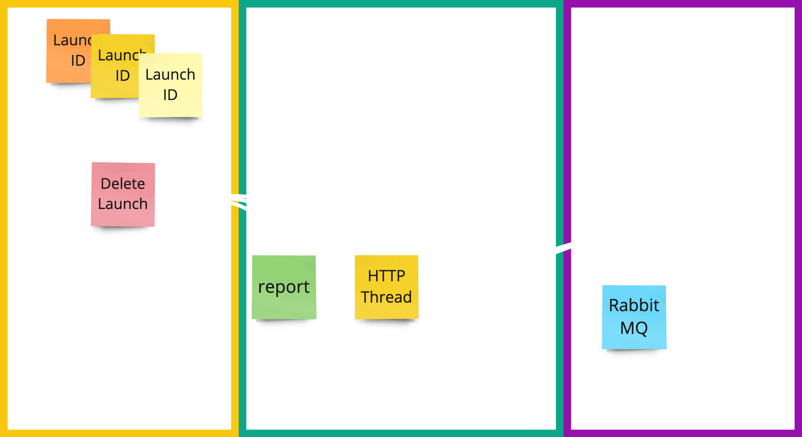

---

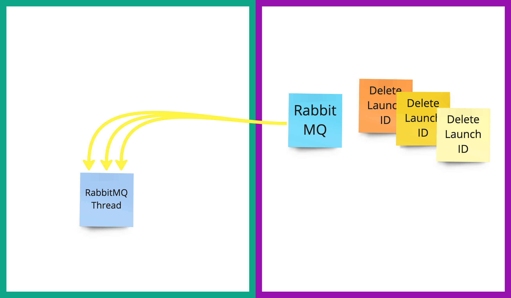

---

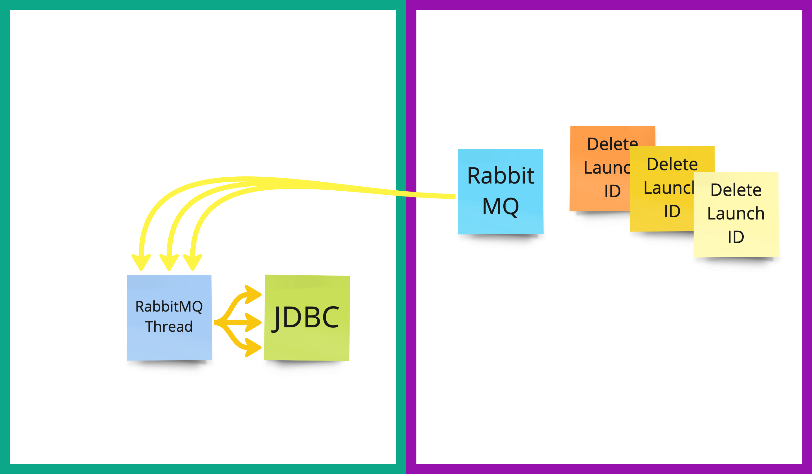


---

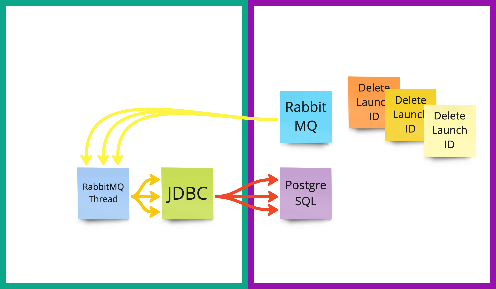

---

# Выросло количество потоков:
## - taskExecutor
## - __rabbitConnectionFactorySharedExecutor__
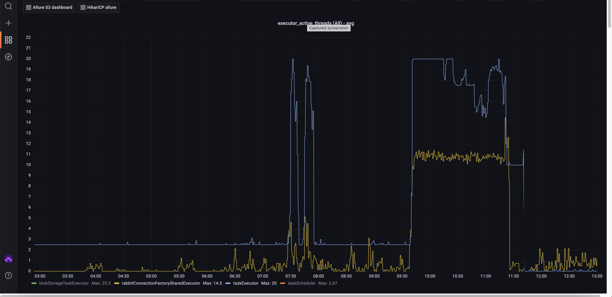

---

# Утилизация __CPU__ 
## на __PostgreSQL__ = 100%
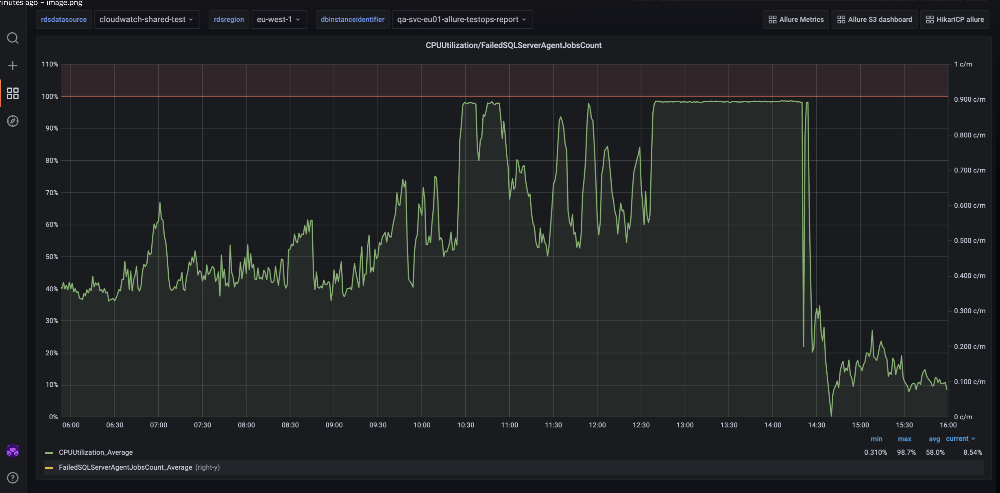


---

<!-- _class: main -->

# Delete (tool) > __Vacuum__


---


<!-- _class: main problem -->

## 🟣 __Рекомендации и скрипты__

# Как автоматизировать оптимизации?

---

<!-- _class: main  -->

## __Ваши вопросы__

# ☕️ Оптимизация вашей __Allure TestOps__, приходите в  qa_load

<!--
_footer: `Images from vlad.studio. Slides from https://polarnik.github.io/Allure.TestOps.SpeedUp/slides.html`

 -->
